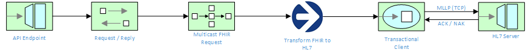

# API FHIR to HL7 v2.4



For this scenario, we expose a RESTful API that accepts an MRN , then queries the FHIR / JPA server with 2 parallel requests (Patient and Condition).  The API responds with an HL7 document that is forwarded to an HL7 server (over the MLLP protocol).

#### Prerequisite installation steps

In order to run this example, a evaluation license must be obtained from [Trace Financial](https://www.tracefinancial.com/contact-us).  For the purpose of this example, Transformer version 3.6.9-SNAPSHOT is assumed.  Once the Transformer tooling has been downloaded, please execute the following steps to copy the required files to your local Maven repository:

1. Copy <transformer-install-dir>\runtime\3.6.9-SNAPSHOT\maven\transformer-runtime-skinny-3.6.9-SNAPSHOT.jar to a temp directory

2. Copy <transformer-install-dir>\runtime\3.6.9-SNAPSHOT\maven\transformer-runtime-skinny-3.6.9-SNAPSHOT.pom to a temp directory

3. Copy <transformer-install-dir>\lib\transformer-designtime-3.6.3.jar and <transformer-install-dir>\runtime\3.6.9-SNAPSHOT\currency-lib to a temp directory

4. Execute the following commands via the CLI to install the prerequisite JAR files in your local Maven repostiory:

```
mvn install:install-file -DgroupId=com.tracegroup.transformer -DartifactId=transformer-runtime-skinny -Dversion=3.6.9-SNAPSHOT -Dpackaging=pom -Dfile=transformer-runtime-skinny-3.6.9-SNAPSHOT.pom.xml

mvn install:install-file -DgroupId=com.tracegroup.transformer -DartifactId=currencylib -Dversion=1.0.10 -Dfile=currencylib-1.0.10.jar -Dpackaging=jar
```

5. Install the Trace Transformer sample project to your local Maven repository by executing the following command:

```
mvn install:install-file -DgroupId=com.tracefinancial.pocs -DartifactId=scenario5 -Dversion=0.1 -Dfile=scenario5-0.1.jar -Dpackaging=jar
```

### Running the example standalone with SpringBoot

The example can be demonstrated by running the following command:

```
    mvn spring-boot:run
```

To test via the Swagger docs, navigate to `http://localhost:8080/swagger-ui.html` via the Web Browser.

### Running the example in Docker

1. Setup Docker and ensure it is running on your machine.  On MacOS, I ran the following commands:

	```bash
	docker-machine create default
	docker-machine start default
	eval "$(docker-machine env default)"
	```
	
2.  Ensure Docker is accessible from the CLI by typing `docker ps`.  You should get back an empty response indicating no docker images are running.

3.  Run `docker-machine ip` to determine what the IP is for docker. You'll need this IP to connect to the Fuse Management Console (hawt.IO) running inside the SpringBoot container.

4.  Ping your local host machine to capture you IP.  Update the hostname for `activemq.broker.url` located in `src/main/resources/application.properties` with your host machine IP.

5.  To build the project, execute the following:

	```bash
	mvn -s configuration/settings.xml clean package docker:build
	```
    
6.  To run the project, execute the following:

	```bash
	docker run -p 8080:8080 -p 8081:8081 -t example/scenario-five
	```
	
7.  After you've finished running the docker example, be sure to tidy up:
	
	```bash
	docker ps (to obtain the container ID)
	docker stop <container ID>
	docker rm <container ID>
	```
	
## Viewing the Fuse Management Console (HawtIO)

Once the application has started up successfully, in any web browser, go to `localhost:8081/hawtio/index.html` and select the Camel tab. You should see your Camel Routes running.  For the docker example, replace this with `http:\\docker-host-ip:8081/hawtio/index.html`.

### Running the example in OpenShift

It is assumed that:
- OpenShift platform is already running, if not you can find details how to [Install OpenShift at your site](https://docs.openshift.com/container-platform/3.9/install_config/index.html).
- Your system is configured for Fabric8 Maven Workflow, if not you can find a [Get Started Guide](https://access.redhat.com/documentation/en/red-hat-jboss-middleware-for-openshift/3/single/red-hat-jboss-fuse-integration-services-20-for-openshift/)

#### Setup service accounts, config map and secrets

1. Login to your OpenShift instance using oc login CLI
2. Create a new OpenShift project using `oc new-project scenario-five`
3. Create a service account using `oc create -f src/main/fabric8/sa.yml`
4. Create the secrets using `oc create -f src/main/fabric8/secret.yml`
5. Create the configmap using `oc create -f src/main/fabric8/configmap.yml`
6. Add the secret to the service account using `oc secrets add sa/qs-scenario-five-config secret/scenario-five-config`
7. Give view permission to the service account using `oc policy add-role-to-user view system:serviceaccount:scenario-five:qs-scenario-five-config`
8. The example can be built and run on OpenShift using a single goal:

```
    mvn -P ocp
```

When the example runs in OpenShift, you can use the OpenShift client tool to inspect the status

To list all the running pods:

```
    oc get pods
```

Then find the name of the pod that runs this quickstart, and output the logs from the running pods with:

```
    oc logs <name of pod>
```

You can also use the openshift [web console](https://docs.openshift.com/container-platform/3.3/getting_started/developers_console.html#developers-console-video) to manage the
running pods, and view logs and much more.
