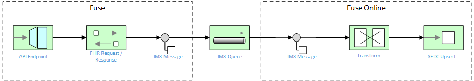

# API FHIR to SalesForce (Patient Updates)

For this scenario, we expose a RESTful API that accepts a list of CSV-delimited MRN's.  The service calls a backend FHIR server to retrieve Patient resources for each matching MRN, with each corresponding Patient object placed on a JMS queue.  A separate Fuse Online service consumes the Patient objects off a queue and converts them into the corresponding SFDC objects, then performs a Salesforce "upsert" into Salesforce Health Cloud.

#### Prerequisite installation steps

1.  Install the AMQ 6.3 broker (with SSL enabled) on OpenShift using [these](https://access.redhat.com/documentation/en-us/red_hat_jboss_a-mq/6.3/html/red_hat_jboss_a-mq_for_openshift/get_started) instructions
2.  Install Fuse Online using [these](https://access.redhat.com/documentation/en-us/red_hat_fuse/7.0/html/integrating_applications_with_ignite/installing-on-ocp) instructions

### Running the example in OpenShift

It is assumed that:
- OpenShift platform is already running, if not you can find details how to [Install OpenShift at your site](https://docs.openshift.com/container-platform/3.9/install_config/index.html).
- Your system is configured for Fabric8 Maven Workflow, if not you can find a [Get Started Guide](https://access.redhat.com/documentation/en/red-hat-jboss-middleware-for-openshift/3/single/red-hat-jboss-fuse-integration-services-20-for-openshift/)

#### Setup service accounts, config map and secrets

1. Login to your OpenShift instance using oc login CLI
2. Change to the Fuse Ignite OpenShift project using `oc project fuse-ignite`
3. Create a service account using `oc create -f src/main/fabric8/sa.yml`
4. Create the secrets using `oc create -f src/main/fabric8/secret.yml`
5. Create the configmap using `oc create -f src/main/fabric8/configmap.yml`
6. Add the secret to the service account using `oc secrets add sa/qs-scenario-three-config secret/scenario-three-config`
7. Give view permission to the service account using `oc policy add-role-to-user view system:serviceaccount:fuse-ignite:qs-scenario-three-config`
8. The example can be built and run on OpenShift using a single goal:

    mvn -P ocp

When the example runs in OpenShift, you can use the OpenShift client tool to inspect the status

To list all the running pods:

    oc get pods

Then find the name of the pod that runs this quickstart, and output the logs from the running pods with:

    oc logs <name of pod>

You can also use the openshift [web console](https://docs.openshift.com/container-platform/3.3/getting_started/developers_console.html#developers-console-video) to manage the running pods, and view logs and much more.
