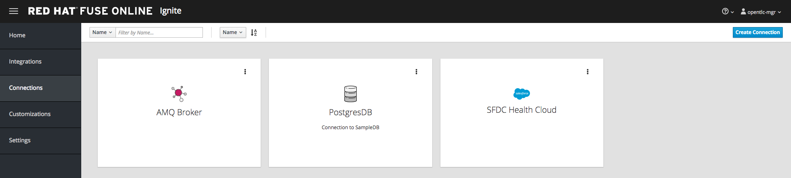

# API FHIR to SalesForce (Patient Updates)


For this scenario, we expose a RESTful API that accepts a list of CSV-delimited MRN's.  The service calls a backend FHIR server to retrieve Patient resources for each matching MRN, with each corresponding Patient object placed on a JMS queue.  A separate Fuse Online service consumes the Patient objects off a queue and converts them into the corresponding SFDC objects, then performs a Salesforce "upsert" into Salesforce Health Cloud.

#### Prerequisite installation steps

1.  Change to the Fuse Ignite OpenShift project using `oc new-project fuse-online`
2. Install Fuse Online using [these](https://access.redhat.com/documentation/en-us/red_hat_fuse/7.0/html/integrating_applications_with_ignite/installing-on-ocp) instructions, into a project called fuse-online.
3. Delete all deployment configs, services and routes related to the existing broker-amq service installed by default with Fuse Online.  This step can be completed via the OpenShift Web Interface.
4.  Using the same Fuse Online Openshift project, install the AMQ 6.3 broker (with SSL enabled) on OpenShift using [these](https://access.redhat.com/documentation/en-us/red_hat_jboss_a-mq/6.3/html/red_hat_jboss_a-mq_for_openshift/get_started) instructions, starting with Section 4.2.2 "Creating the Service Account".  Create the service account first, followed by the secret using the command `oc secrets new amq-app-secret broker.ks broker.ts` and passing the keystores located in `src/main/resources`.
5. Once the broker has started, navigate to Services and create a route for the `broker-amq-tcp-ssl` service.  Ensure to secure the route with 'Passthrough' SSL termination.

### Running the example standalone with SpringBoot

The example can be demonstrated by running the following command:

```
    mvn spring-boot:run
```

### Running the example in OpenShift

It is assumed that:
- OpenShift platform is already running, if not you can find details how to [Install OpenShift at your site](https://docs.openshift.com/container-platform/3.9/install_config/index.html).
- Your system is configured for Fabric8 Maven Workflow, if not you can find a [Get Started Guide](https://access.redhat.com/documentation/en/red-hat-jboss-middleware-for-openshift/3/single/red-hat-jboss-fuse-integration-services-20-for-openshift/)

#### Setup service accounts, config map and secrets

1. Login to your OpenShift instance using oc login CLI
2. Change to the Fuse Ignite OpenShift project using `oc project fuse-online`
3. Create a service account using `oc create -f src/main/fabric8/sa.yml`
4. Create the secrets using `oc create -f src/main/fabric8/secret.yml`
5. Create the configmap using `oc create -f src/main/fabric8/configmap.yml`
6. Add the secret to the service account using `oc secrets add sa/qs-scenario-three-config secret/scenario-three-config`
7. Give view permission to the service account using `oc policy add-role-to-user view system:serviceaccount:fuse-online:qs-scenario-three-config`
8. The example can be built and run on OpenShift using a single goal:

```
    mvn -P ocp
```

When the example runs in OpenShift, you can use the OpenShift client tool to inspect the status

To list all the running pods:

```
    oc get pods
```

Then find the name of the pod that runs this quickstart, and output the logs from the running pods with:

```
    oc logs <name of pod>
```

You can also use the openshift [web console](https://docs.openshift.com/container-platform/3.3/getting_started/developers_console.html#developers-console-video) to manage the running pods, and view logs and much more.

#### Configuring the Fuse Online Integration

1. Login to your Fuse Online instance.
2. Login to SFDC using your credentials.  Navigate to Create > Apps and create a Connected App.  Be sure to enter a callback URL that matches the URL for your Fuse Online instance.
3. In Fuse Online, navigate to Settings > Salesforce and enter your SFDC client ID and secret
4. In Fuse Online, navigate to Connections and setup a SFDC connection
5. Create a connection to your AMQ broker using the failover URL: `failover://ssl://broker-amq-tcp-ssl-fuse-online.apps.nashville.openshiftworkshop.com:443`.  Ensure client certificates is disabled.
6. If you have setup your connections correctly, you should see the following:



7. Create a new integration, consuming from the AMQ broker (source) and specifying queue "incomingMessageChannel"
8. For the output data type, use either a JSON instance or schema of the Patient object.  There are sample JSON messages in the incomingMessageChannel that can be used.
9. Set the SFDC Health Cloud destination.  Select "Create or Update Record".
10. Map the fields according to your mapping specification
11. Publish the integration.
12. Tail the SpringBoot log via the OpenShift console.

